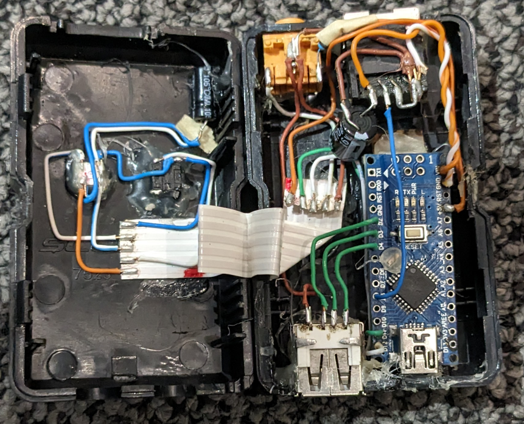
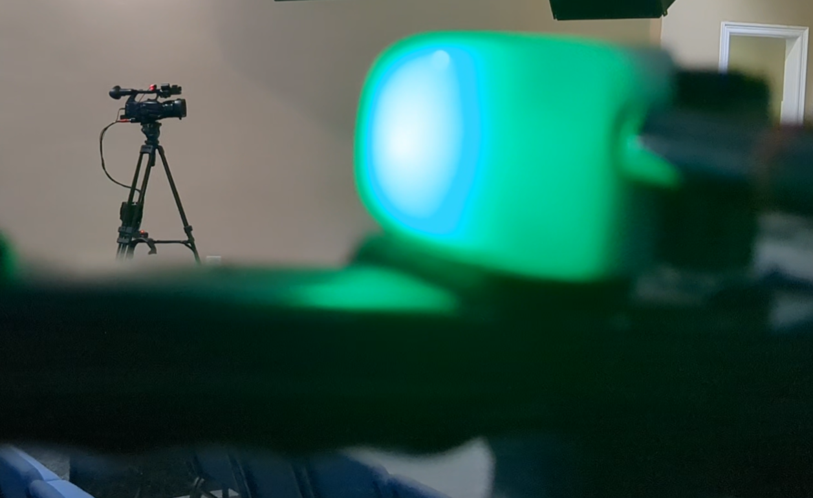

# RTX V1 - Amir Gorkovchenko (2020 - 2021)
### !! Deprecated Version !!

#### (RTX) Receive-Transmit-Exchange
Control Camera switching and Tally lights via a custom one-wire(RTX) protocol.
The one-wire protocol is designed to run on a single category cable carrying the one-wire bus signal and 12v power supply.
This protocol has been successfully tested at over 100ft

All code runs on Atmega328p processors and can be compiled using Arduino IDE

## Each branch denotes a different device with a specialized purpose in the custom network

### ATEM:
Communicates with ATEM video switchers to retrieve tally status'.
This information is relayed to targeted devices on one-wire network through a status polling method (repeated transition).

This device later merged into the companion device to become one device with two functions.

### Companion:
Communicates with a target PC with an installed software called BitFocus Companion, a powerful and flexible software that has programmable macros in order to communicate with ATEM's and various other network devices.

This device triggers different macros based on received commands from the center-side-switcher devices.

This device later adopted the ATEM tally functionality

### Center-Side-Switcher
These devices are located at the cameras were they can be used to control cameras or give tally status'.

Named Center-Side-Switcher because we primarily have a center and side camera.

These devices get communication from the one-wire bus wire and power from the 12v provided by the same cable.

These devices have two sets of two LED's (Red & Orange). One is built into the device for connection and device status.
The second LED is external for the tally light located on the Camera's carried by an AUX cable.
Both LED set's will flash if it encounters an EEPROM error or connection issue

These devices each have the ability to connect to external buttons (a tri-foot-pedal in our case) with each button programed to different macros

### GUI
GUI (General User Interface)

This device acts as a bridge between the computer and the one-wire network and allows for extensive configuration for Center-Side-Switcher devices without re-flashing the devices.
The Center-Side-Switcher each are configured through their EEPROM and include an integrity check on boot-up

The configuration is mostly included for the button configuration

### Other
This is where the program for the master device is. This is also where the development code is stored.
The master device facilitates the communication for each of the devices.

The master buffers the packets and waits for the receiving device to become available before transmitting the packet.
Each slave device has a simple address that allows other devices to target it with packets.

This protocol was designed to be reliable with a low chance of packet loss

## Photos

Using my first osiliscope to develop and debug RTX protocol:

\
\
Inside V1 Center-Side-Switcher box:

\
\
Cameras with external Tally Lights. (green in foreground and red in the background):

